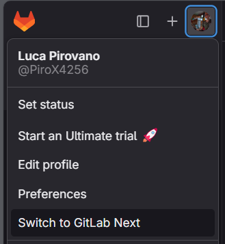

# odm-platform-adapter-executor-gitlab

This repository contains the ODMPlatform Adapter Executor specifically designed for GitLab. It facilitates the
integration and execution GitLab CI/CD pipelines.

# Requirements

The following project require the following ODM modules up & running:

- ODM Registry
- ODM DevOps
- ODM Param Service

# Configuration

There are a few configurations to carry out before launching the adapter.

Indeed, the following environment variables must be set:

- PARAMS_SERVICE_ADDRESS: set it to the IP of the params service.
- PARAMS_SERVICE_CLIENT_UUID: set it to a valid client UUID (as configured in parameter service).
- DATABASE_HOST: JDBC url to connect to the database.
- DATABASE_USERNAME
- DATABASE_PASSWORD

# Run It

## Run from binaries

### Prerequisites

The project requires the following dependencies:

- Java 11
- Maven 3.8.6
- ODM Platform / DevOps module

Compile the project:

```bash
mvn clean install -DskipTests
```

Run the jar file:

```bash
java -jar target/gitlabciexecutor-<version>.jar
```

## Run With Docker

It is possible to run the image in docker containers.

```bash
docker run 
--name odm-executor-gitlab-app 
-p 9004:9004
-e PARAMS_SERVICE_ADDRESS=<value>
-e PARAMS_SERVICE_CLIENT_UUID=<value>
-e DATABASE_HOST=<value>
-e DATABASE_USERNAME=<value>
-e DATABASE_PASSWORD=<value>
-e FLYWAY_SCRIPTS_DIR=<value>
--net host 
odm-executor-gitlab
```

# Usage

Since the GitLab instances can be used both in cloud or deployed to on-premise environments,
two configurations are required for each managed instance of GitLab.

- instance URL, for example https://gitlab.com or https://my_gitlab.example.com
- Personal Access Token, for authentication and authorization.

## Obtaining Access Token

To obtain a personal GitLab access token, it is necessary to log in to the instance
and perform the following actions. For demo purpose, the actions are performed on the GitLab.com website.

1. Log-In to gitlab.com.
2. Go to "Preferences".



4. Click on "Access Token" from the side menu.
5. Click on "Add new Token".
6. Give a descriptive name to the token.
7. Set an expiration date.
8. Select "api" and "read_api" scopes.
9. Click "Create personal access token".
10. Note down the value, since it won't be displayed again.

## Configuring instance

To create a new GitLab instance configuration, the following API call must be executed:

```bash
curl --location '<ip-address>:9004/config' \
--header 'Content-Type: application/json' \
--data '{
"instanceUrl": "https://gitlab.com",
"instanceToken": "<instance-token>"
}'
```

## Setting up the Data Product Descriptor

In order to correctly execute the pipeline, it is necessary to
insert some information inside the Data Product Descriptor JSON file.

The following example shows a sample configuration:

```json
{
  "internalComponents": {
    "lifecycleInfo": {
      "provisionInfraDev": [
        {
          "service": {
            "$href": "gitlab"
          },
          "template": {
            "specification": "spec",
            "specificationVersion": "2.0",
            "definition": {
              "projectId": "<value>",
              "branch": "master"
            }
          },
          "configurations": {
            "params": {
              "gitlabInstanceUrl": "https://gitlab.com",
              "callbackBaseURL": "http://[IP]:8002/api/v1/pp/devops"
            },
            "stagesToSkip": []
          }
        }
      ]
    }
  }
}
```

## Start activities
After the base configuration of the environment,it is possible
to invoke the pipelines by creating and starting an activity from the
ODM devops module. Refer to the proper documentation for further information.